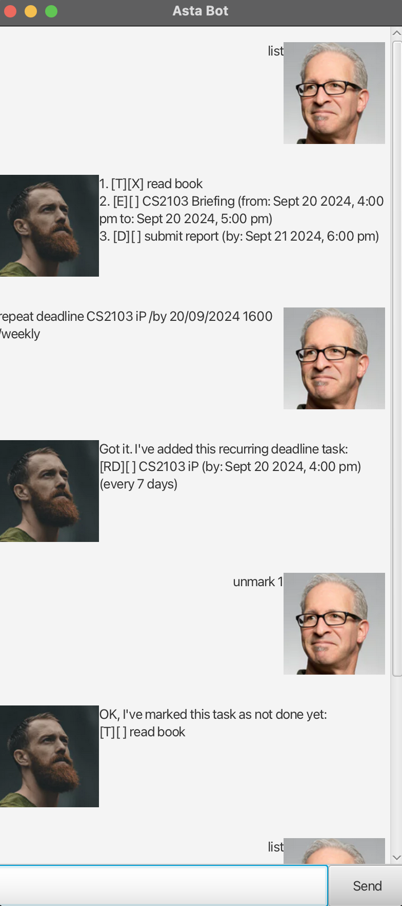

theme: minima

# Asta User Guide

## Product Introduction: Asta Task Manager

Asta is an intuitive and intelligent task management application designed to
help users stay organized and manage their daily, recurring, and project-related
tasks efficiently. The app is particularly suited for individuals and teams
looking to streamline their workflow and keep track of deadlines, events, and
to-dos with minimal effort.

## Key Features:

1. Task Tracking: Easily create tasks, set deadlines, and manage your workload.
2. Recurring Tasks: Manage recurring events, meetings, or deadlines with
   customizable intervals (daily, weekly, monthly).
3. Smart Input Parsing: Asta interprets natural language commands like repeat
   deadline submit report /by 12/09/2024 1800 /weekly, making task creation
   seamless and user-friendly.
4. Task Management: Mark tasks as complete, unmark them if needed, and delete
   tasks once they’re done. All with simple commands.
5. Task Search: Quickly find tasks based on keywords to stay on top of what
   matters most.
6. Persistent Storage: Tasks are saved automatically, ensuring your to-dos and
   deadlines are always accessible, even after restarting the app.

## Why Use Asta?

- Efficiency: Create tasks quickly with natural language input and let Asta
  handle the rest.
- Recurrence Support: Perfect for managing recurring tasks like weekly
  meetings or monthly reports without needing to re-enter them each time.
- Ease of Use: Simple commands, combined with robust task management features,
  make Asta a breeze to use for both individuals and teams.
